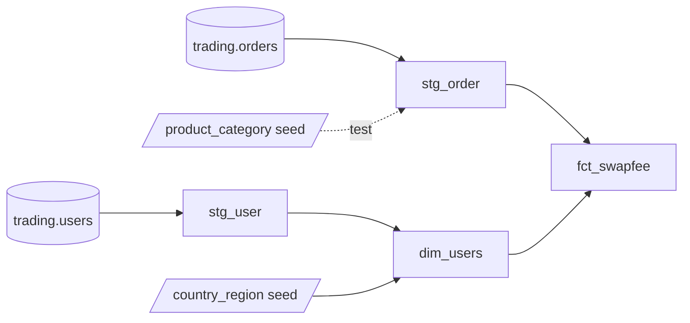

# Swap Fee Data Product (dbt + BigQuery)

[](https://github.com/chiwei82/dataSolutionDemo/actions/workflows/ci.yml)
[](https://github.com/chiwei82/dataSolutionDemo/actions/workflows/cd.yml)

**Live dbt docs:** https://chiwei82.github.io/dataSolutionDemo/

A personal analytics engineering project, modelled on a broker's finance use case and built on synthetic data. It turns raw trading data into a tested, documented data product that answers two questions for every order: **how many end-of-day (EOD) rollovers the position was held through**, and **whether it is charged a swap fee or an admin fee** (swap-free accounts).

**Tech stack:** SQL · dbt (Fusion 2.0) · Google BigQuery (GCP) · dbt_utils · Git / GitHub · GitHub Actions (CI/CD) · Python (synthetic data generation, not included in this repo)

## The problem

Overnight fees depend on trading-calendar rules that are easy to get wrong in ad-hoc SQL: weekends and market holidays (Christmas) have no rollover, and clients in some regions hold swap-free accounts that are charged an admin fee instead. This project centralises those rules in one version-controlled, tested dbt model that downstream reporting could read as a single source of truth.

## Highlights

- **Data modelling:** layered staging → marts architecture with a fact table (`fct_swapfee`) and a dimension table (`dim_users`) on a cloud data warehouse, built over **20,000 synthetic orders** and **1,000 synthetic users** across **29 products** and **34 cities**.
- **Automated testing and data quality:** **36 data tests and 1 unit test** in total (generic, `dbt_utils`, singular SQL and unit tests), covering primary keys, referential integrity, accepted values and the EOD business rules. `dbt build` runs the full pipeline and every test in under a minute.
- **Business logic as code:** the EOD calendar rules (weekends, Christmas, same-day orders) are pinned down by a unit test with hand-built edge cases, so a logic change that breaks them makes `dbt build` fail before `fct_swapfee` is rebuilt.
- **CI/CD:** GitHub Actions builds and tests every pull request in an isolated BigQuery `dbt_ci` dataset; merges to `main` deploy to a `dbt_prod` dataset and publish the dbt docs site to GitHub Pages.
- **Documentation and maintainability:** every model, column and seed is documented; shared definitions live in reusable doc blocks; reference data (country → region, product → category) is managed as dbt seeds instead of being hard-coded in SQL.

## Data

All data is synthetic, generated with a Python script (kept outside this repo) and loaded into BigQuery:

| Table | Columns |
|---|---|
| `projectfeecalcu.main.orders` | `id`, `userid`, `_etl_loaded_at`, `product`, `category`, `opentime`, `closetime` |
| `projectfeecalcu.main.users` | `id`, `login`, `platform`, `_create_time`, `country` |

- 20,000 orders opened and closed between 2024-12-15 and 2024-12-31
- 1,000 users on `mt4` / `mt5`, spread across 34 city codes grouped into 3 regions
- 29 products across `FX`, `XAU`, `XAG`, `Crude`, `Equities`, `Index` and `Cmdty`

## Project structure

```
models/
├── staging/
│   ├── _src_trading.yml        source definition for projectfeecalcu.main
│   ├── _stg_trading.yml        staging docs and tests
│   ├── stg_order.sql
│   └── stg_user.sql
├── marts/
│   ├── _marts.yml              marts docs, tests and unit test
│   ├── dim_users.sql
│   └── fct_swapfee.sql
└── docs.md                     shared doc blocks
seeds/
├── _seeds.yml                  seed docs and tests
├── country_region.csv          country code → city → region
└── product_category.csv        product → category
tests/
├── assert_eod_count_within_holding_days.sql
└── assert_order_category_matches_product.sql
packages.yml                    dbt_utils
ci/
└── profiles.yml                ci and prod targets for GitHub Actions
.github/workflows/
├── ci.yml                      pull request: dbt build in dbt_ci
└── cd.yml                      push to main: dbt build in dbt_prod, publish docs
```

## Lineage



## Models

| Model | Layer | Materialization | Grain |
|---|---|---|---|
| `stg_order` | staging | view | one row per order |
| `stg_user` | staging | view | one row per user |
| `dim_users` | marts | table | one row per user, with city and region |
| `fct_swapfee` | marts | table | one row per order |

### Business rules in `fct_swapfee`

**`eod_count`**: the number of EODs an order was held through.

- One EOD per calendar day from the open date up to the day before the close date (UTC midnight)
- Only trading days count: Saturdays, Sundays and 25 December have no EOD
- An order opened and closed on the same day has `eod_count = 0`

**`fee_type`**: based on the user's region.

| fee_type | Rule |
|---|---|
| `admin` | User's country is in `Muslim_Majority_Europe` (treated as a swap-free account) |
| `swap` | All other regions |

## Testing

| Type | Where | Examples |
|---|---|---|
| Generic tests | `_*.yml` | `unique`, `not_null`, `relationships`, `accepted_values` |
| Package tests | `_marts.yml` | `dbt_utils.expression_is_true` (`closed_at > opened_at`) |
| Unit test | `_marts.yml` | `eod_count` over weekends, Christmas and same-day orders; `fee_type` by region |
| Singular tests | `tests/` | `eod_count` within holding days; order category matches the product seed |

## CI/CD

| Workflow | Trigger | What it does |
|---|---|---|
| [`ci.yml`](.github/workflows/ci.yml) | Pull request to `main` | Installs dbt Fusion, runs `dbt deps` and `dbt build --target ci` against the `dbt_ci` dataset |
| [`cd.yml`](.github/workflows/cd.yml) | Push to `main` | Runs `dbt build --target prod` against the `dbt_prod` dataset, then `dbt docs generate` and publishes the site to GitHub Pages |

Environments are separate BigQuery datasets in the same project:

| Dataset | Used by |
|---|---|
| `dbt_dev` | Local development |
| `dbt_ci` | Pull request checks |
| `dbt_prod` | `main` branch deployments |

Both workflows read the service-account key from the `GCP_SA_KEY` repository secret and use the profile in [`ci/profiles.yml`](ci/profiles.yml), which contains no credentials.

## Getting started

The source tables are not public and the data generator is not in this repo, so running the project requires loading equivalent `orders` and `users` tables into your own BigQuery dataset and pointing `_src_trading.yml` at it.

1. Add a BigQuery service-account profile named `dataSolutionDemo` to `~/.dbt/profiles.yml`:

   ```yaml
   dataSolutionDemo:
     target: dev
     outputs:
       dev:
         type: bigquery
         method: service-account
         project: projectfeecalcu
         dataset: dbt_dev
         keyfile: /path/to/keyfile.json
   ```

   The service account needs permission to run query jobs and to read and write datasets (for example **BigQuery Job User** and **BigQuery Data Editor**).

2. Install packages, then build seeds, models and tests:

   ```bash
   dbt deps
   dbt build
   ```

3. Generate the documentation site:

   ```bash
   dbt docs generate
   ```

## Resources

- [dbt documentation](https://docs.getdbt.com/docs/introduction)
- [dbt best practices: how we structure our dbt projects](https://docs.getdbt.com/best-practices/how-we-structure/1-guide-overview)
