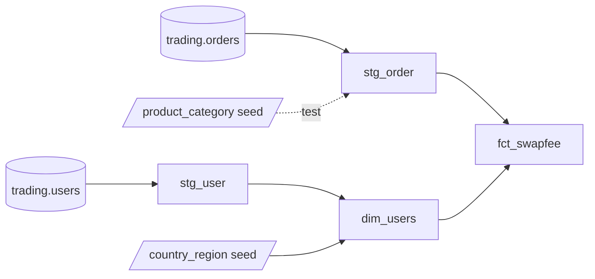

# Swap Fee Data Product (dbt + BigQuery)

A dbt demo project that models synthetic trading data into a data product for the finance team: for every order, how many end-of-day (EOD) rollovers it was held through, and whether it is charged a **swap** or an **admin** fee.

Built with **dbt Fusion 2.0** on **Google BigQuery**.

## Data

The raw data is synthetic and lives in BigQuery:

| Table | Columns |
|---|---|
| `projectfeecalcu.main.orders` | `id`, `userid`, `_etl_loaded_at`, `product`, `category`, `opentime`, `closetime` |
| `projectfeecalcu.main.users` | `id`, `login`, `platform`, `_create_time`, `country` |

- 20,000 orders opened and closed between 2024-12-15 and 2024-12-31
- 1,000 users on `mt4` / `mt5`, located in 34 European cities
- 29 products across `FX`, `XAU`, `XAG`, `Crude`, `Equities`, `Index` and `Cmdty`

## Project structure

```
models/
├── staging/
│   ├── _src_trading.yml        source definition for projectfeecalcu.main
│   ├── _stg_trading.yml        staging docs and tests
│   ├── stg_order.sql
│   └── stg_user.sql
├── marts/
│   ├── _marts.yml              marts docs, tests and unit test
│   ├── dim_users.sql
│   └── fct_swapfee.sql
└── docs.md                     shared doc blocks
seeds/
├── _seeds.yml
├── country_region.csv          country code → city → region
└── product_category.csv        product → category
tests/
├── assert_eod_count_within_holding_days.sql
└── assert_order_category_matches_product.sql
```

## Lineage



## Models

| Model | Layer | Materialization | Grain |
|---|---|---|---|
| `stg_order` | staging | view | one row per order |
| `stg_user` | staging | view | one row per user |
| `dim_users` | marts | table | one row per user, with city and region |
| `fct_swapfee` | marts | table | one row per order |

### Business rules in `fct_swapfee`

**`eod_count`**: the number of EODs an order was held through.

- One EOD per calendar day from the open date up to the day before the close date (UTC midnight)
- Only trading days count: Saturdays, Sundays and 25 December have no EOD
- An order opened and closed on the same day has `eod_count = 0`

**`fee_type`**: based on the user's region.

| fee_type | Rule |
|---|---|
| `admin` | User's country is in `Muslim_Majority_Europe` (swap-free account) |
| `swap` | All other regions |

## Testing

| Type | Where | Examples |
|---|---|---|
| Generic tests | `_*.yml` | `unique`, `not_null`, `relationships`, `accepted_values` |
| Package tests | `_marts.yml` | `dbt_utils.expression_is_true` (`closed_at > opened_at`) |
| Unit test | `_marts.yml` | `eod_count` over weekends, Christmas and same-day orders; `fee_type` by region |
| Singular tests | `tests/` | `eod_count` within holding days; order category matches the product seed |

## Getting started

1. Add a BigQuery service-account profile named `dataSolutionDemo` to `~/.dbt/profiles.yml`:

   ```yaml
   dataSolutionDemo:
     target: dev
     outputs:
       dev:
         type: bigquery
         method: service-account
         project: projectfeecalcu
         dataset: dbt_dev
         keyfile: /path/to/keyfile.json
   ```

   The service account needs **BigQuery Job User** and **BigQuery Data Editor**.

2. Install packages, then build seeds, models and tests:

   ```bash
   dbt deps
   dbt build
   ```

3. Generate the documentation site:

   ```bash
   dbt docs generate
   ```

## Resources

- [dbt documentation](https://docs.getdbt.com/docs/introduction)
- [dbt best practices: how we structure our dbt projects](https://docs.getdbt.com/best-practices/how-we-structure/1-guide-overview)
